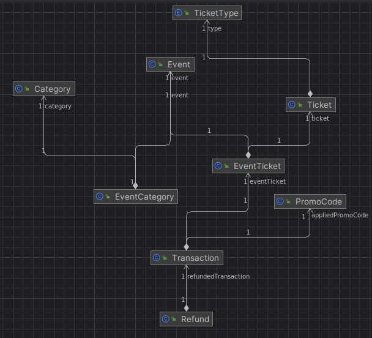

# Proposed simple Passboard challenge

## As requirements stated, this is a simple Passboard app for just user can Purchase ticket, apply promo code to it, and given the chance to refund

The solution uses a Sequential Datastore with Six main core entities, Visitor, Event, Transaction, Refund, PromoCode, Ticket

Project is split into main two modules, Digital Identity Management and Payment Management, first one shall handle Authentication and Authorization but exempted due to simplicity of the task, the other is responsible for making money transactions such as buy tickets and refunding it

Sample of APIs are in [_**Requests**_](generated-requests.http)